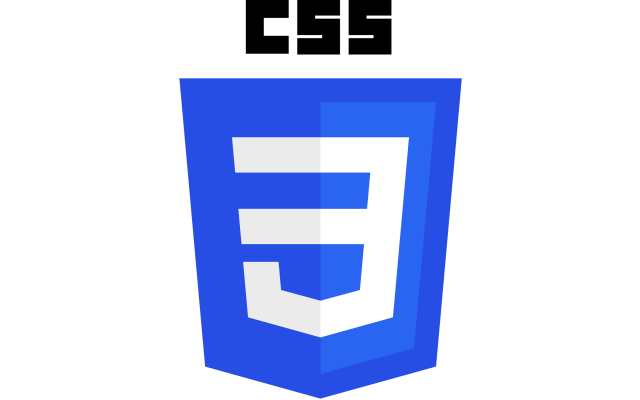

<!DOCTYPE html>
<html lang="en">
<head>
    <meta charset="UTF-8">
    <meta name="viewport" content="width=device-width, initial-scale=1.0">
    <link rel = "stylesheet" href ="estilos.css">
    <link rel = "stylesheet" href ="reset.css">

    <title>Página Nueva</title>
    
</head>
<body>
    <header>
        

           

            <h1 class="title" id="principal">Mi pagina personal</h1>
            <h2 class = "title">Francisco Echeverri</h2>
           
 
           

          
           
 
        

    </header>
    <main>

    </main>
     <article>
    
  
        <h3 class="title">Full Stack Developer</h3>
        
me llamo Francisco, soy de Cali, valle, Colombia y me gusta derarrollar

        
si bien tengo conocimientos Full Satck, me gusta mucho desarrollar aplicaciones

    
  
    </article>

    <article>
 
       

    <h4 class="title">HTMl</h4>
    

    <h4 class="title">CSS</h4>
    

    <h4 class="title">JAvascript</h4>
    

    </article>
   
   
</body>
</html>